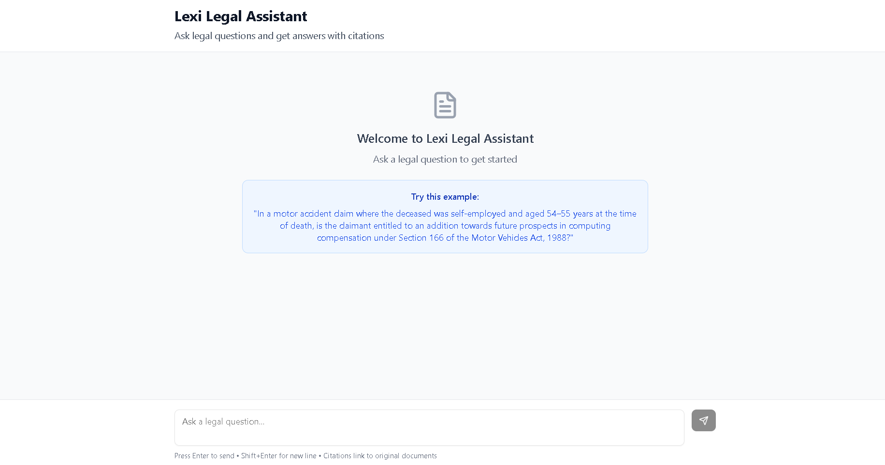
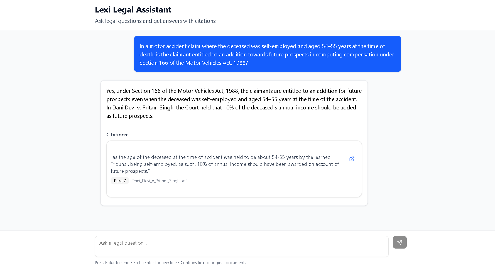
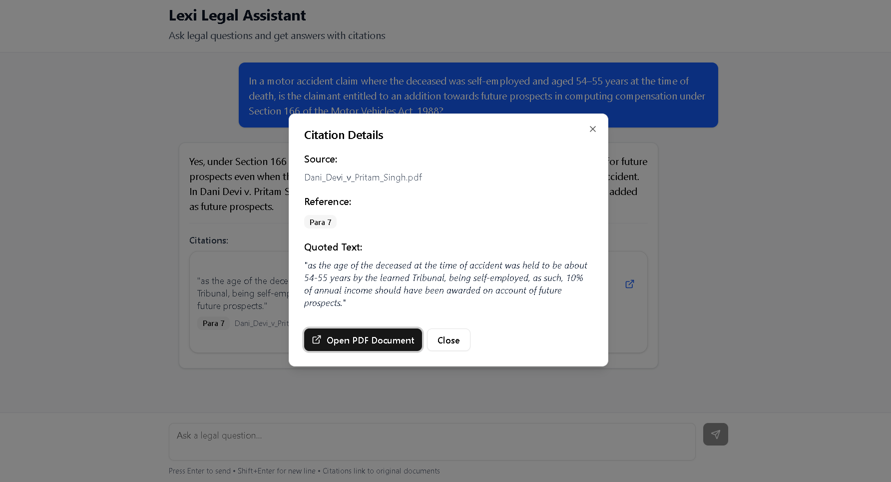

# Lexi Legal Assistant - Frontend Assignment

A minimal frontend interface for a legal assistant that allows users to ask legal questions, receive AI-generated answers, and view citations with links to original PDF documents.

#### Deployed Vercel Link: [https://lexisg-frontend-intern-test-sandy-mu.vercel.app/](https://lexisg-frontend-intern-test-sandy-mu.vercel.app/)

## Features

- **Chat-like Interface**: Similar to ChatGPT with a clean, modern design
- **Legal Question Input**: Text area for entering legal queries
- **AI-Generated Answers**: Simulated responses with proper legal formatting
- **Citation Handling**: Clickable citations that open PDF documents
- **Loading States**: Visual feedback during query processing
- **Responsive Design**: Works on desktop and mobile devices

## Tech Stack

- **React.js** with Next.js App Router
- **TypeScript** for type safety
- **Tailwind CSS** for styling
- **shadcn/ui** components for UI elements
- **Lucide React** for icons

## Getting Started

### Prerequisites

- Node.js 18+ 
- npm or yarn

### Installation

1. Clone the repository:
```bash
git clone https://github.com/AnkushS27/Lexisg-frontend-intern-test.git
cd Lexisg-frontend-intern-test
```

2. Install dependencies:
```bash
npm install
```

3. Run the development server:
```bash
npm run dev
```

4. Open [http://localhost:3000](http://localhost:3000) in your browser

## Usage

1. **Ask a Question**: Type your legal question in the text area at the bottom
2. **Submit**: Click the send button or press Enter
3. **View Answer**: The AI-generated response will appear in the chat
4. **Click Citations**: Click on any citation card to open the PDF document
5. **PDF Handling**: Citations open in a new tab with a dialog showing citation details

### Example Query

Try this sample query:
```
In a motor accident claim where the deceased was self-employed and aged 54–55 years at the time of death, is the claimant entitled to an addition towards future prospects in computing compensation under Section 166 of the Motor Vehicles Act, 1988?
```

## Citation Handling

- Citations are displayed as clickable cards below the answer
- Each citation shows the quoted text, paragraph reference, and source document
- Clicking a citation opens a dialog with details and a link to the PDF
- PDFs open in a new tab for easy reference
- The system simulates scrolling to specific paragraphs (Paragraph 7 in the example)

## API Simulation

The application simulates API responses without requiring a backend:

```typescript
const simulatedResponse = {
  answer: "Legal answer text...",
  citations: [
    {
      text: "Quoted text from document",
      source: "Document_Name.pdf",
      link: "https://document-url.com",
      paragraph: "Para 7"
    }
  ]
}
```

## Features Implemented

- ✅ Chat-like interface similar to ChatGPT
- ✅ Legal question input with loading states
- ✅ AI-generated answer display
- ✅ Citation cards with source information
- ✅ PDF opening in new tabs
- ✅ Citation dialog with detailed information
- ✅ Responsive design
- ✅ TypeScript implementation
- ✅ Modern UI with Tailwind CSS

## Bonus Features

- **Citation Dialog**: Shows detailed citation information before opening PDF
- **Loading Animation**: Smooth loading states with spinner
- **Responsive Design**: Works on all device sizes
- **Accessibility**: Proper ARIA labels and keyboard navigation
- **Type Safety**: Full TypeScript implementation

## Screenshots




The interface closely matches the ChatGPT design with:
- Clean chat bubbles for questions and answers
- Citation cards with hover effects
- Professional legal document styling
- Intuitive navigation and interaction

## License

This project is created for the Lexi frontend internship assignment.
